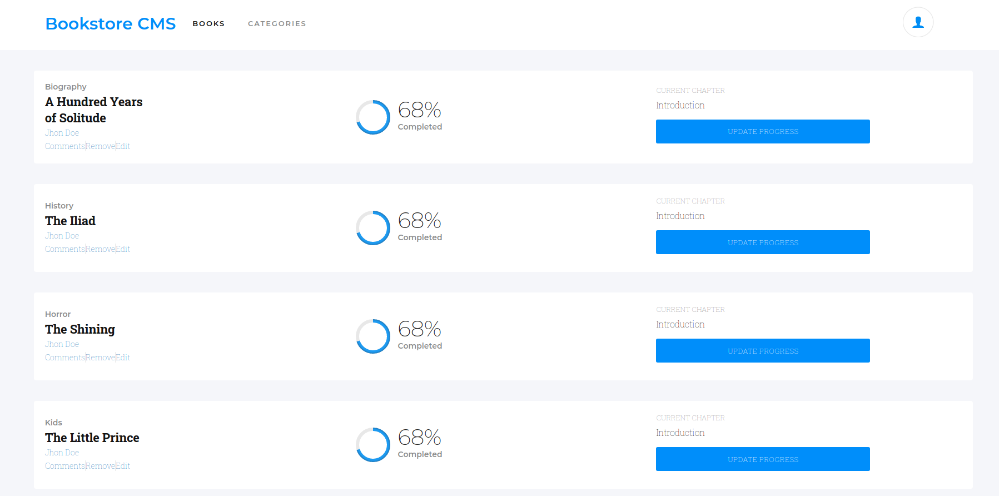

# Bookstore CMS

It is a bookstore app that organizes and stores books based on categories. It is built with Javascript React & Redux frameworks getting a dynamic and responsive app.

## Live Preview

[See the Book Store Online App](https://javier-bookstore.herokuapp.com/)



## Built With

- React
- Redux
- Javascript
- CSS
- Node
- npm

## Getting start

In order to start with the project:

1. Install npm in your machine.
2. Clone [this repository](https://github.com/javierbotero/bookstore.git)
3. cd inside the project

4. Run
```
  npm i
```
in the terminal to install the dependencies.
5. Run
```
  npm start
```
And you will have the bookstore working locally.

## Authors

👤 **Javier Botero**

- Github: [@Javierbotero](https://github.com/javierbotero)
- Twitter: [@Javierbotero1](https://twitter.com/Javierboterodev)
- Linkedin: [Javierbotero](https://www.linkedin.com/in/javierboterodev/)


## 🤝 Contributing

Contributions, issues and feature requests are welcome!

## Show your support

Give a ⭐️ if you like this project!